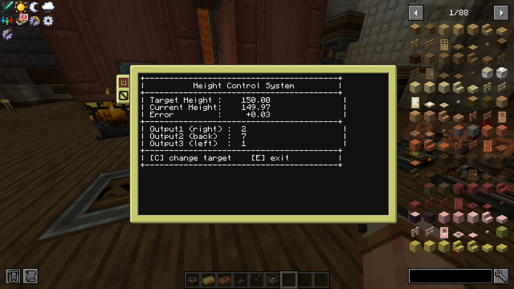
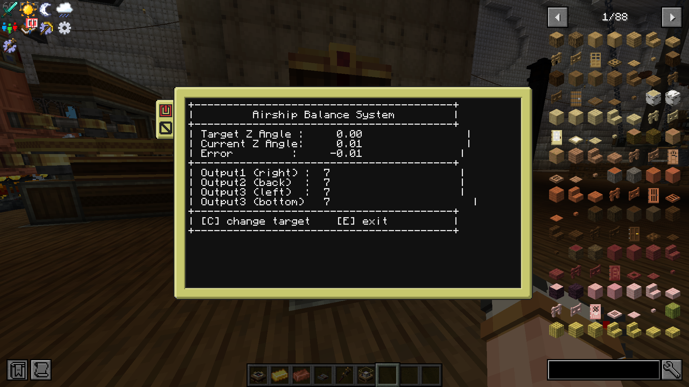

# AeronauticsPIDControl
A CC:T PID control program for  Create:Aeronautics airships  
用于使用CC:T来精准控制飞艇，热气球的高度和平衡。  
高度控制算法采用三级输出提高精准度，而平衡控制算法则采用两级输出  
基础PID算法库来自https://github.com/zerodegress/AeronauticsPidFireBallon  
## 使用方法
height.lua为高度控制算法，启动时输入初始值和目标高度，合适的初始值可以降低达到目标所需时间。程序运行中也可以按C键改变目标高度。  
当前高度来自航空学的海拔传感器，要贴放在电脑背后。三级输出值会从右、上、左输出。三级对应的热空气输出体积上限应每一级设定为上一级的1\15。  
local control = pid.createPid(0.05, 0.001, 0.05, 0.1,initOutput)这里是PID算法初始化设定参数的地方，从前往后对应kp，ki，kd，和步长。建议针对飞行器自行调整kp，ki，kd。  
  
balance.lua为平衡控制算法，启动时输入初始值和目标船体角度。程序运行中也可以按C键改变目标角度。  
船体角度来自航空学的方向传感器，要贴放在电脑顶部。设计中有前后两个气囊，每个气囊初始灌入热空气为燃烧器设定值的一半，并在调整平衡时保证两个气囊总热空气不变保证升力不变避免调平导致高度变化。这里的凉级对应的热空气输出体积上限也应每一级设定为上一级的1\15。  
同样的，建议针对飞行器自行调整平衡控制算法中的kp，ki，kd。  
  
